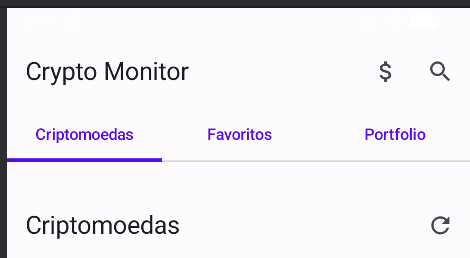
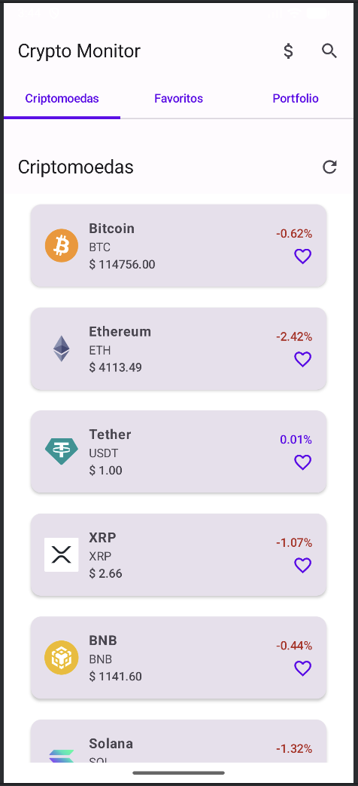
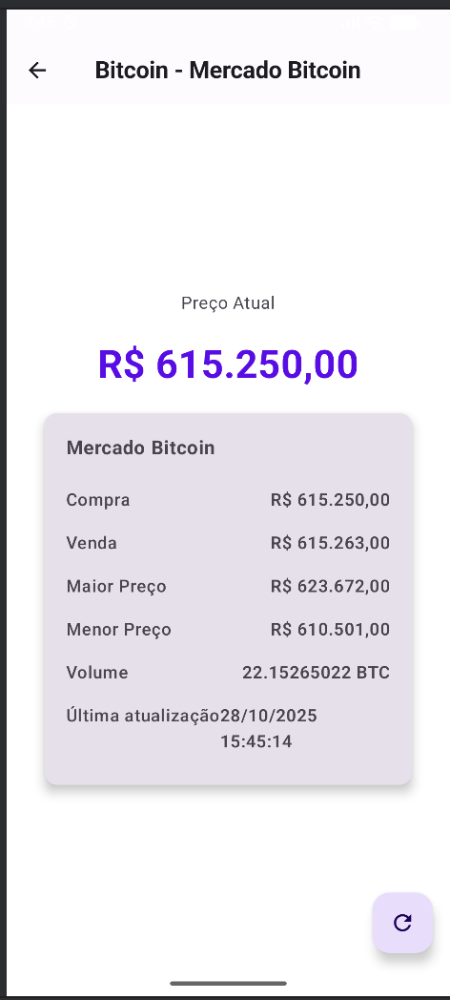
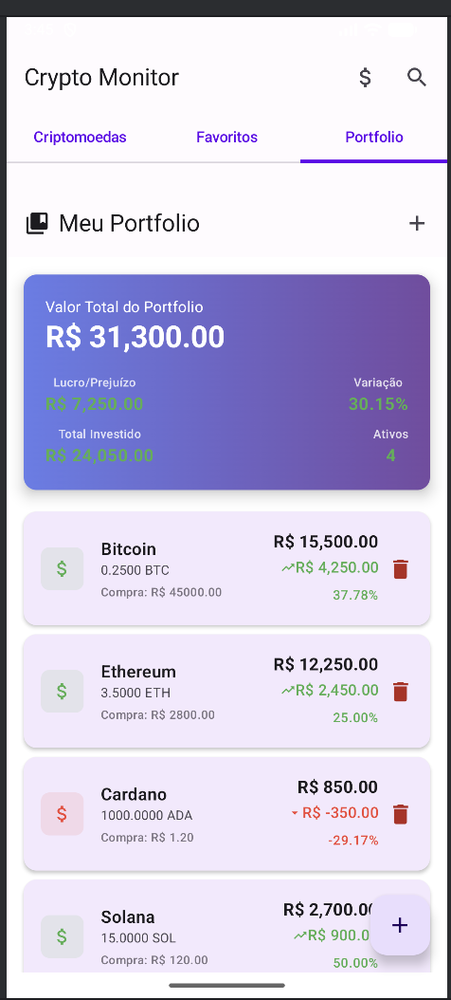
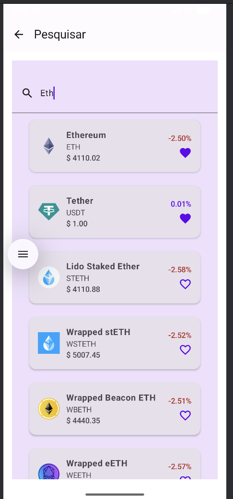

# 📱💰 Crypto Monitor

Um aplicativo moderno para **monitoramento de criptomoedas** desenvolvido em **Jetpack Compose**, que consome dados em tempo real de múltiplas APIs.

---

## 📸 Capturas de Tela

### 🏠 Tela Principal - Home  
  
Navegação por abas entre **Criptomoedas**, **Favoritos** e **Portfolio**.

### 📈 Lista de Criptomoedas  
  
Lista em tempo real com preços em Dólar, variações e funcionalidade de favoritos.

### 💬 Tela de Detalhes  
  
Informações detalhadas de cada criptomoeda.

### 🇧🇷 Mercado Bitcoin  
  
Dados específicos do Mercado Bitcoin com preços em BRL. Mesma tela do antigo projeto de Criptomoedas

### ❤️ Favoritos  
  
Criptomoedas favoritadas pelo usuário.

### 💼 Portfolio  
  
Acompanhamento de investimentos com cálculos de lucro/prejuízo.

### 🔍 Busca  
  
Busca em tempo real por criptomoedas.

---

## 🚀 Funcionalidades

### 📊 Monitoramento em Tempo Real
- Preços atualizados de **50+ criptomoedas**
- Variação percentual em 24h  
- Market cap e volume de negociação  
- Atualização automática a cada 30 segundos  

### ⭐ Sistema de Favoritos
- Adicione/remova criptomoedas dos favoritos  
- Lista dedicada para acompanhamento rápido  
- Persistência durante a sessão  

### 💼 Gestão de Portfolio
- Adicione criptomoedas ao seu portfolio  
- Acompanhe preço de compra vs preço atual  
- Cálculo automático de lucro/prejuízo  
- Valor total do investimento  

### 🔍 Busca Avançada
- Busca em tempo real por **nome ou símbolo**  
- Interface de pesquisa moderna do **Material3**  
- Navegação direta para detalhes  

### 🌐 Multi-Fonte de Dados
- **CoinGecko API**: Dados globais em USD  
- **Mercado Bitcoin API**: Dados específicos em BRL  
- Alternância fácil entre fontes  

---

## 🛠️ Tecnologias Utilizadas

### 🧱 Arquitetura
- **MVVM (Model-View-ViewModel)**  
- **Repository Pattern**  
- **State Management** com Flow/StateFlow  

### 💯 Android Moderno
- **Jetpack Compose** – UI totalmente declarativa  
- **Material Design 3** – Design system moderno  
- **Navigation Compose** – Navegação type-safe  
- **ViewModel** – Gerenciamento de estado da UI  

### 🌐 Networking
- **Retrofit + GSON** – Cliente HTTP e parsing JSON  
- **Coroutines** – Programação assíncrona  
- **Coil** – Carregamento de imagens  

### 🔌 APIs Consumidas
- `https://api.coingecko.com` – Dados globais de criptomoedas  
- `https://www.mercadobitcoin.net` – Dados do mercado brasileiro  

---

## 🏗️ Estrutura do Projeto
```bash

app/
├── data/
│   ├── api/              # Interfaces Retrofit
│   ├── model/            # Data classes
│   └── repository/       # Camada de acesso a dados
├── ui/
│   ├── screens/          # Telas do aplicativo
│   ├── components/       # Componentes reutilizáveis
│   ├── viewmodel/        # ViewModels
│   └── navigation/       # Configuração de navegação
└── theme/               # Cores e temas

```


---

## 📱 Telas Disponíveis

### 1️⃣ HomeScreen
- Aba **Criptomoedas**: Lista principal com auto-atualização  
- Aba **Favoritos**: Lista personalizada do usuário  
- Aba **Portfolio**: Visão geral dos investimentos  
- Botão **Mercado Bitcoin**: Acesso rápido aos dados em BRL  

### 2️⃣ CryptoScreen
- Lista paginada de criptomoedas  
- Indicador de loading com **shimmer effect**  
- Tratamento de erros de rede  
- Pull-to-refresh manual  

### 3️⃣ DetailsScreen
- Informações detalhadas da criptomoeda selecionada  
- Preço atual e histórico de 24h  
- Market cap, volume e rankings  
- Gráficos de variação *(se disponível)*  

### 4️⃣ BitcoinPriceScreen
- Dados específicos do Mercado Bitcoin  
- Preços de compra e venda em tempo real  
- Maior e menor preço do dia  
- Volume negociado em BTC  

### 5️⃣ PortfolioScreen
- Visão consolidada dos investimentos  
- Cálculos automáticos de performance  
- Adição/remoção de ativos  
- Demonstrativo de lucro/prejuízo  

### 6️⃣ SearchScreen
- Busca em tempo real  
- Interface de pesquisa do Material3  
- Filtragem instantânea  

---

## ⚙️ Configuração e Build

### 🧩 Pré-requisitos
- Android Studio **Hedgehog** ou superior  
- SDK Android **34+**  
- Kotlin **1.9.21+**

### 🏗️ Build
```bash
./gradlew assembleDebug
